# CMOS-inverter-2
***This is the part 2 of the CMOS-inverter. I've discussed the further concepts related to the inverter like noise margin,propagation delay,rise and fall time etc.***
***
In the previous repo CMOS-inverter i had discussed the basic concepts of the inverter.This will be a continuation to the previous discussion. Lets explore more about our inverter and see what it has got more to provide to us. I'll be frequently updating the repository.<br />
<br />
**Note:
      Length:180nm
      PMOS Width Wp: 800nm
      NMOS Width Wn: 400nm**
***
### Contents
***
***
***
***
***
***
## 1.Transient Analysis
## 1.1 Review
Lets quickly look into the behaviour of the inverter.The input to the the inverter is a square wave with **Rise time and Fall time of 2ns**,**T(on)=10ns** and the period of the input wave is **T(period)=20ns**.As you can see the signal gets inverted and output.<br />
<br />
**Schematic:**
<br>
**Output:**
<br>
## 1.2 Variation in load Capacitence (cload).
Lets try plotting the output voltage of an inverter for different values of load capcitance.There's certain amount of delay introduced as the capacitence value increases.Certainly this is not desired,closely observed for higher values the output wpnt reach to full VDD.So we will have to always keep in mind the maximum and minimum load capacitence while designing
<br>
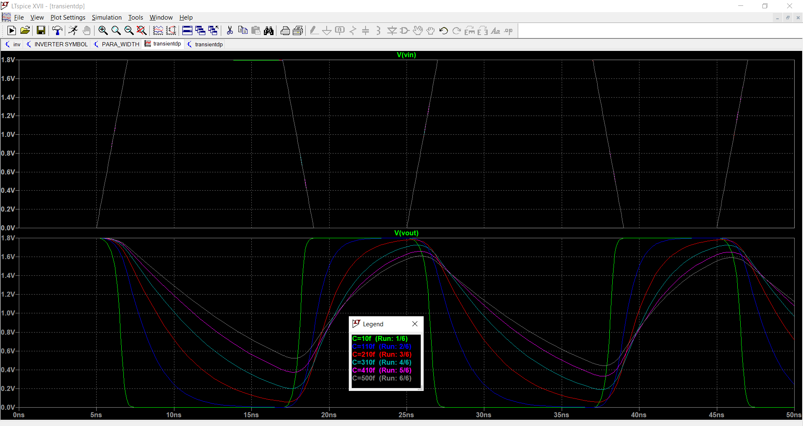<br>
Now lets analyise the output signal.Closely observe the propagation delay in the output.
***
## 1.3 Rise-Time and Fall-Time
<br>
### Fall-Time
Fall time is defined as the time taken for the output signal from 90% of final value to 10% of the final value.The difference between these time interval yields the fall time (**tfall**).<br />
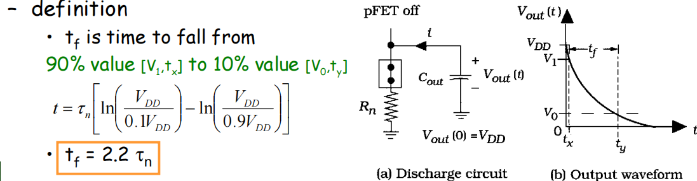<br>
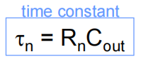<br>
<br />
### Rise Time
Rise time is defined as the time taken for the output signal from 10% of final value to 90% of the final value.The difference between these time interval yields the rise  time (**trise**).<br />
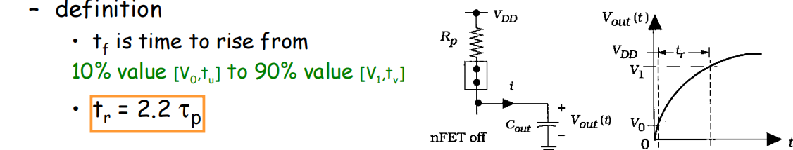<br>
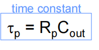<br>
<br />
That was bit of theory to get started with our analysis.I always want a crisp theoritical understanding anf then move into the simulation.The Below figure shows the simulation out for the rise time and fall time.<br />
**Schematic**<br />
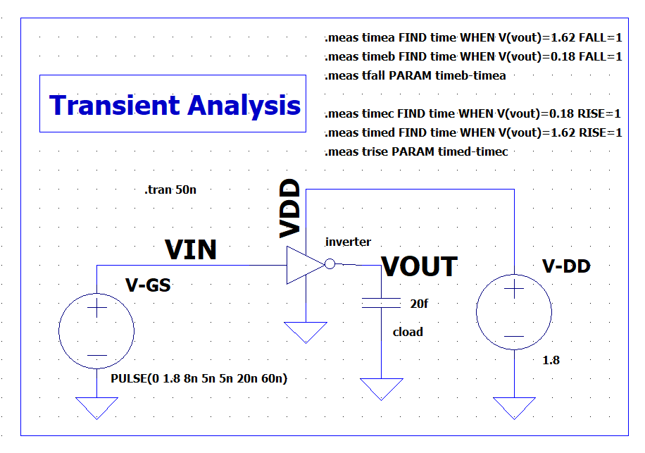<br>
**Output**<br />
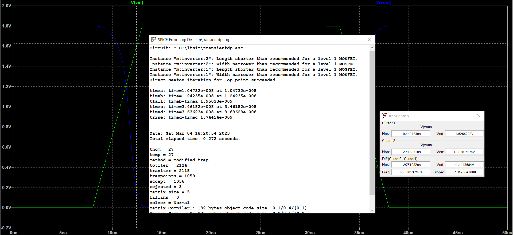<br>
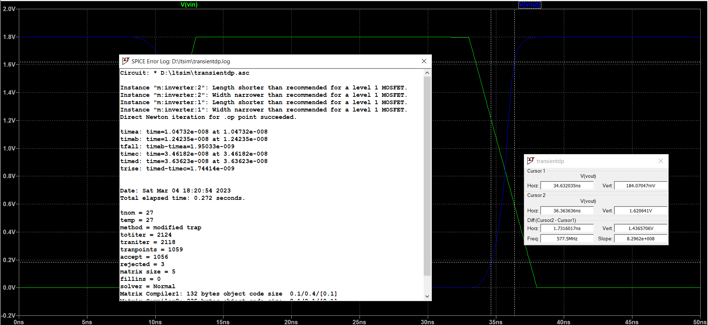<br>
***
## 1.4 Propagation Delay
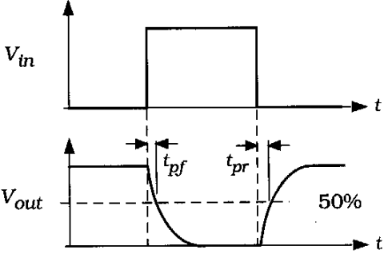<br>
to put it in  simple terms,it measures speed of output reaction to input change.<br />
**Tp=1/2(Tpr+Tpf)**<br />
Fall propagation delay, tpf : time for output to fall by 50% reference to input change by 50%<br />
Rise propagation delay, tpr : time for output to rise by 50% reference to input change by 50%<br />
**Schematic**<br />
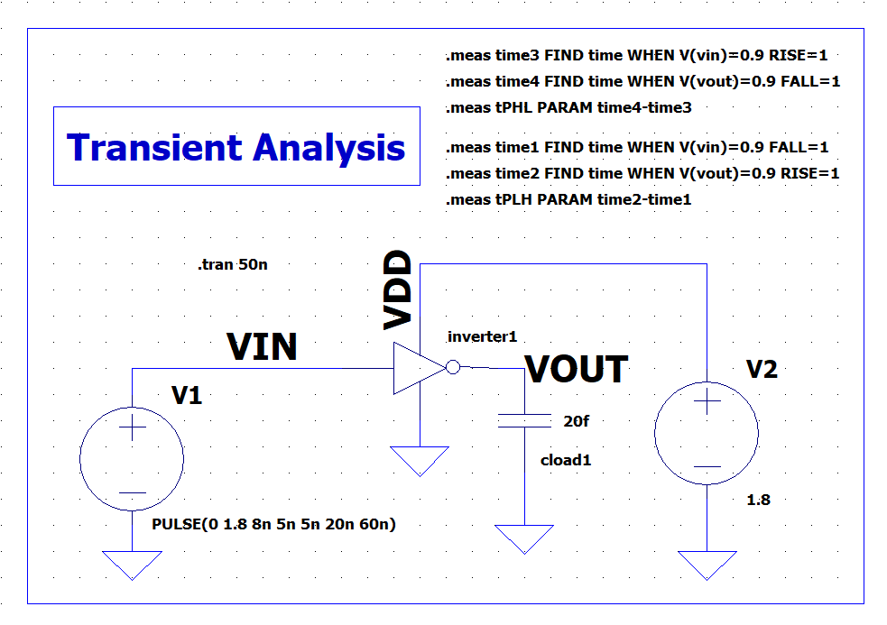<br>
**Output**<br />
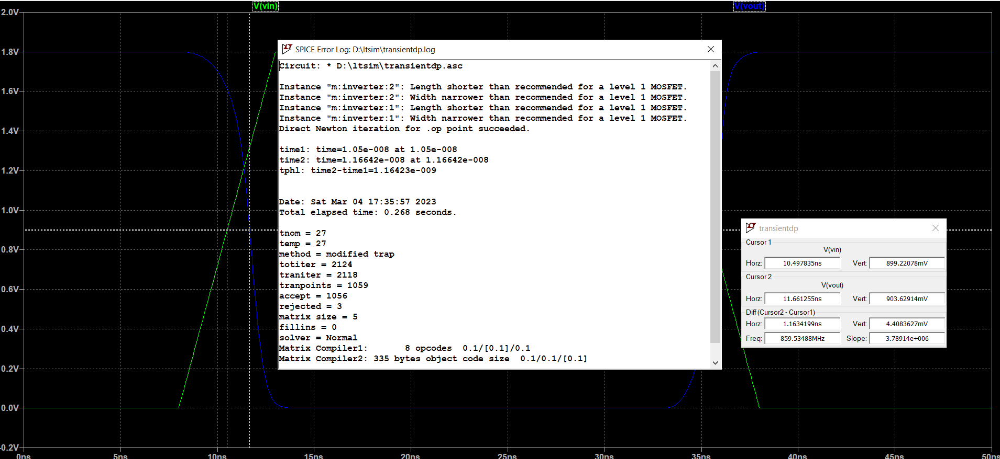<br>
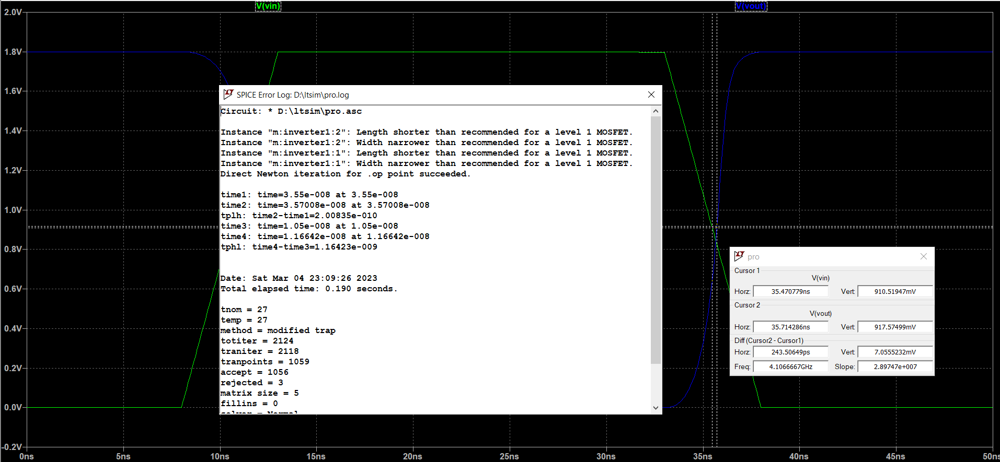<br>
***
## 1.5 Propagation Delay due to Variation in Load Capacitence.
Lets try and check what happens to the propagation delay when the load capacitence increases.Ive increased the the c value in the form of step paramter.
Using the .meas command we can determine the various dealay.I've also included the rise time and fall delay.<br />
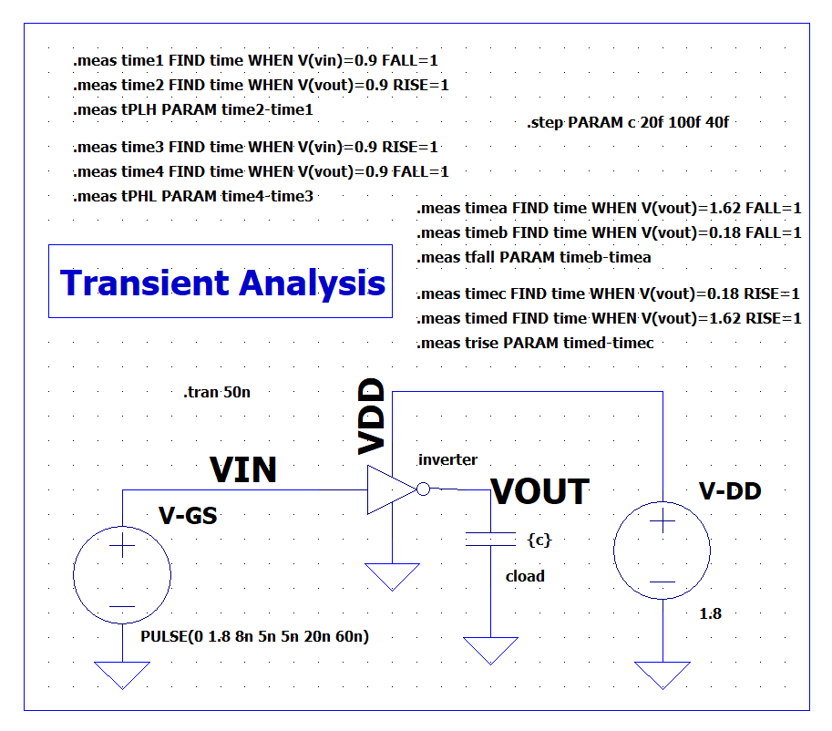<br>
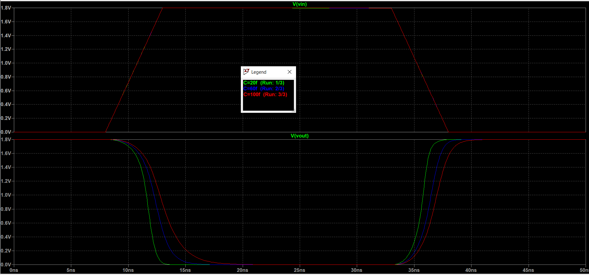<br>
The Output: <br />
```
Measurement: tplh
  step	time2-time1
     1	2.00835e-010
     2	8.65443e-010
     3	1.33927e-009
Measurement: tphl
  step	time4-time3
     1	1.16423e-009
     2	1.88791e-009
     3	2.44852e-009
Measurement: tp
  step	0.5*(tphl+tplh)
     1	6.82535e-010
     2	1.37668e-009
     3	1.89389e-009
Measurement: trise
  step	timed-timec
     1	1.74414e-009
     2	2.37433e-009
     3	2.88539e-009
Measurement: tfall
  step	timeb-timea
     1	1.95033e-009
     2	3.00505e-009
     3	4.15412e-009
```
***
## 2. Noise Margin
<br />
Noise margin is closely related to the DC voltage characteristics. This parameter allows you to determine the allowable noise voltage on the input of a gate so that the output will not be corrupted.<br />
<br />
NML is defined as the difference in maximum LOW input voltage recognized by the receiving gate and the maximum LOW output voltage produced by the driving gate.<br />
<br />
NMH is the difference between the minimum HIGH output voltage of
the driving gate and the minimum HIGH input voltage recognized by the receiving gate.<br />
<br />


