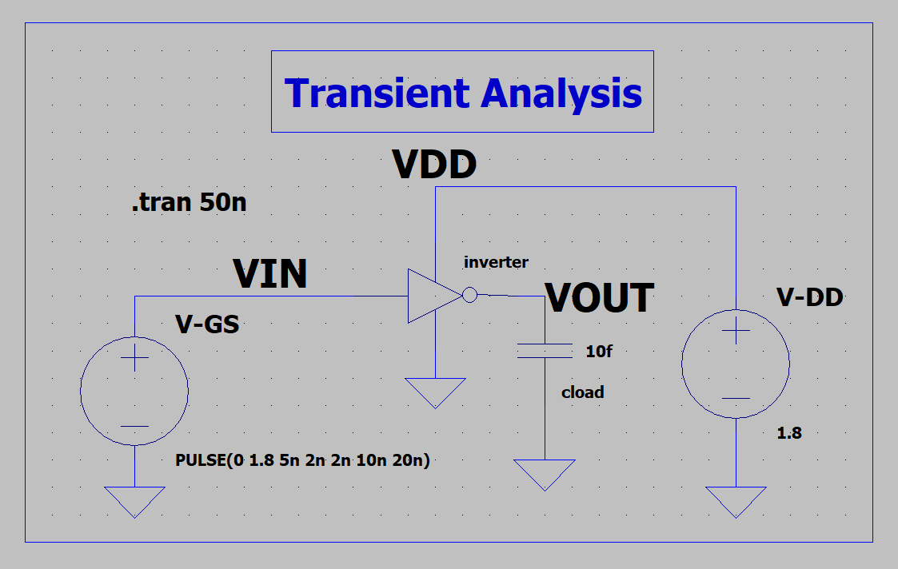
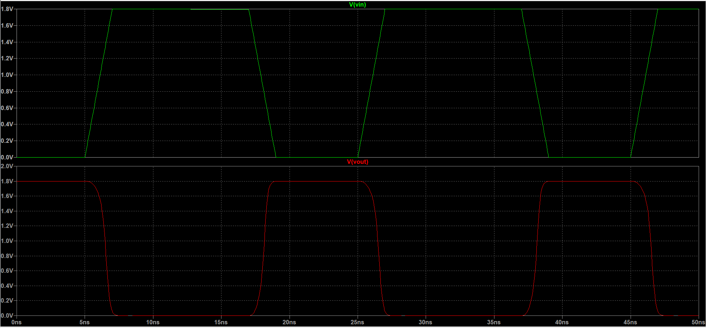
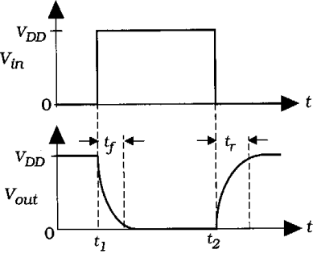

# CMOS-inverter-2
***This is the part 2 of the CMOS-inverter. I've discussed the further concepts related to the inverter like noise margin,propagation delay,rise and fall time etc.***
***
In the previous repo CMOS-inverter i had discussed the basic concepts of the inverter.This will be a continuation to the previous discussion. Lets explore more about our inverter and see what it has got more to provide to us. I'll be frequently updating the repository. 
 
**Note:
      Length:180nm
      PMOS Width Wp: 800nm
      NMOS Width Wn: 400nm**
***
### Contents
***
***
***
***
***
***
## 1.Transient Analysis
## 1.1 Review
Lets quickly look into the behaviour of the inverter.The input to the the inverter is a square wave with **Rise time and Fall time of 2ns**,**T(on)=10ns** and the period of the input wave is **T(period)=20ns**.As you can see the signal gets inverted and output. 
 
**Schematic:**
 
**Output:**
 

Now lets analyise the output signal.Closely observe the propagation delay in the output.
 

